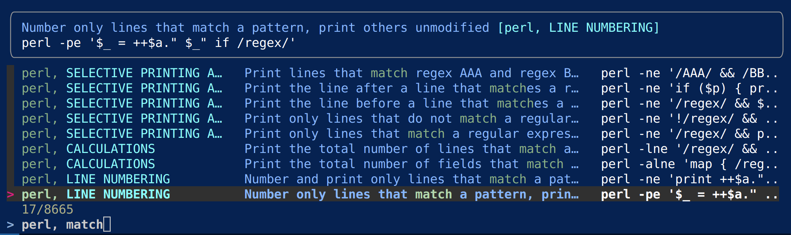

# perl1line.txt for navi

## *Credit*

### *perl1line.txt*

This is a customization of [Peteris Krumins's](http://www.catonmat.net/)   collection of handy perl one-liner scripts, [https://github.com/pkrumins/perl1line.txt](https://github.com/pkrumins/perl1line.txt)

In my repo, in the master branch, the original oneliner scripts have not been changed in any way.

If you are interested in the original, please go to the repository where I have forked this repo from, [https://github.com/pkrumins/perl1line.txt](https://github.com/pkrumins/perl1line.txt).

### *navi*

See [denisidoro/navi](https://github.com/denisidoro/navi): An interactive cheatsheet tool for the command-line.

## *Description*

My customizations of `perl1line.txt` are in the branch `navi-cheatsheet`.

There I have renamed `perl1line.txt` to `navi-perl1line-cheatsheet.txt` and added some comments. Some redundant or alternative Oneliners might have been removed.

The cheatsheet syntax that `navi` requires  is documented [in the navi repo](https://github.com/denisidoro/navi/blob/master/docs/cheatsheet_syntax.md).

## *Why this fork?*

The file `perl1line.txt` is already in the correct format, *almost*. It just needed some additional special-purpose comments, to give it a topical substructure that `navi` can display in its user interface, opened with `CTRL+G`.

In a terminal window, the GUI of `navi` looks like this:

- works for me.
- **(To be continued)**
